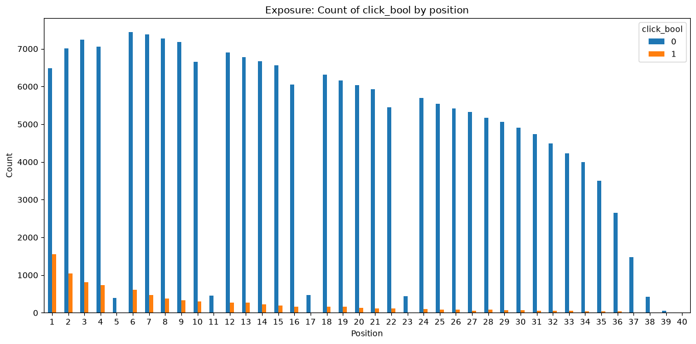
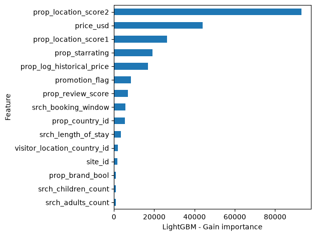
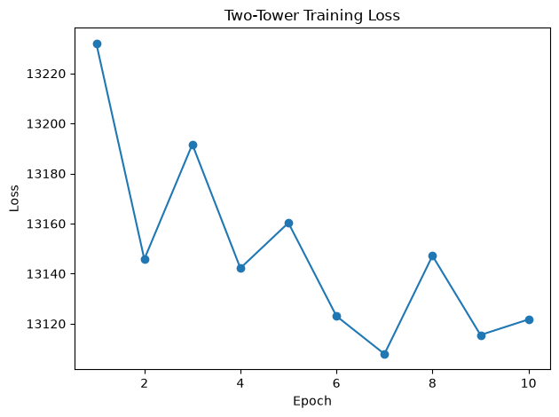
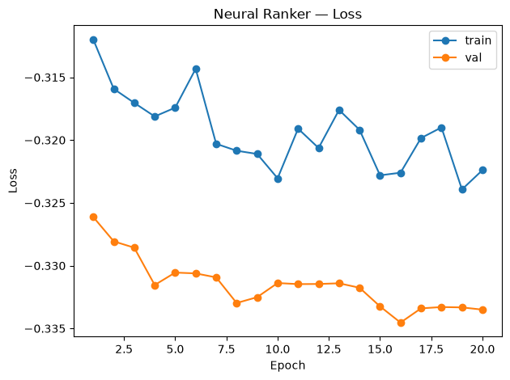

# Learning to Rank Hotel Search Results - A Two-Stage Retrieval and Ranking Pipeline on the Expedia Dataset
## TL;DR
- Built an end-to-end LTR pipeline (data ingestion, retrieval, ranking, evaluation) on ~1M real hotel search logs with graded relevance labels
- LightGBM LambdaRank baseline: `NDCG@5 = 0.379`, stable across an 18-run hyperparameter sweep (range 0.012), establishing that the bottleneck is features, not tuning
- Two-tower retrieval (TFRS, in-batch negatives): `Recall@20 = 0.781` after 30 epochs; loss plateaus at epoch ~10, indicating the ceiling is feature expressiveness and negative quality, not training duration. 
- Neural listwise ranker (TF, ApproxNDCG): `NDCG@5 = 0.110`; val loss better than train loss rules out overfitting; the gap versus LightGBM is from model architecture, not a tuning failure

### Problem Setup
- Task: Given a hotel search, rank a candidate set of 25 hotels by relevance
- Two-stage framing: 
	- *retrieval*: quickly find candidates from a large corpus
	- *ranking*: reorder a short list precisely
- Dataset: [Personalize Expedia Hotel Searches - ICDM 2013](https://www.kaggle.com/c/expedia-personalized-sort) 
	- ~1M rows
	- 54 features
- Graded relevance by interaction: `{no_interaction: 0, click: 1, booking: 5}`
- Evaluation: computed per query group, averaged
	- NDCG@k and MRR for ranking
	- Recall@k for retrieval
### Data Pipeline and Exploratory Data Analysis
The dataset, a collection of (user query, hotel property, query+property interaction) tuples is grouped by user search query (`srch_id`), has a train/val/test split of 10%/10%/80% respectively. 

**Position Bias**
- The data exhibits an exponential click-through rate (CTR) decay. 
- Positions 5, 11, 17, and 23 (spaced every 6 positions) break the trend and are possibly "special" search result positions (e.g., advertisements). 




**Feature Taxonomy**
The TwoTower Retrieval model features a *Query* Tower (user search query details) and an *Item* Tower (hotel properties). Features are assigned to their respective towers according to the following table. `position` is excluded from all feature sets.

| Column Name                 | Data Type | Description                                                                                                                                                                                           | Feature Type |
| --------------------------- | --------- | ----------------------------------------------------------------------------------------------------------------------------------------------------------------------------------------------------- | ------------ |
| srch_id                     | Integer   | The ID of the search                                                                                                                                                                                  | Query        |
| date_time                   | Date/time | Date and time of the search                                                                                                                                                                           | Query        |
| site_id                     | Integer   | ID of the Expedia point of sale (i.e. Expedia.com, Expedia.co.uk, Expedia.co.jp, ..)                                                                                                                  | Query        |
| visitor_location_country_id | Integer   | The ID of the country the customer is located                                                                                                                                                         | Query        |
| visitor_hist_starrating     | Float     | The mean star rating of hotels the customer has previously purchased; null signifies there is no purchase history on the customer                                                                     | Query        |
| visitor_hist_adr_usd        | Float     | The mean price per night (in US$) of the hotels the customer has previously purchased; null signifies there is no purchase history on the customer                                                    | Query        |
| prop_country_id             | Integer   | The ID of the country the hotel is located in                                                                                                                                                         | Item         |
| prop_id                     | Integer   | The ID of the hotel                                                                                                                                                                                   | Item         |
| prop_starrating             | Integer   | The star rating of the hotel, from 1 to 5, in increments of 1.  A 0 indicates the property has no stars, the star rating is not known or cannot be publicized.                                        | Item         |
| prop_review_score           | Float     | The mean customer review score for the hotel on a scale out of 5, rounded to 0.5 increments. A 0 means there have been no reviews, null that the information is not available.                        | Item         |
| prop_brand_bool             | Integer   | +1 if the hotel is part of a major hotel chain; 0 if it is an independent hotel                                                                                                                       | Item         |
| prop_location_score1        | Float     | A (first) score outlining the desirability of a hotel’s location                                                                                                                                      | Item         |
| prop_location_score2        | Float     | A (second) score outlining the desirability of the hotel’s location                                                                                                                                   | Item         |
| prop_log_historical_price   | Float     | The logarithm of the mean price of the hotel over the last trading period. A 0 will occur if the hotel was not sold in that period.                                                                   | Item         |
| position                    | Integer   | Hotel position on Expedia's search results page. This is only provided for the training data, but not the test data.                                                                                  | Query-Item   |
| price_usd                   | Float     | Displayed price of the hotel for the given search.  Note that different countries have different conventions regarding displaying taxes and fees and the value may be per night or for the whole stay | Query-Item   |
| promotion_flag              | Integer   | +1 if the hotel had a sale price promotion specifically displayed                                                                                                                                     | Query-Item   |
| gross_booking_usd           | Float     | Total value of the transaction.  This can differ from the price_usd due to taxes, fees, conventions on multiple day bookings and purchase of a room type other than the one shown in the search       | Query-Item   |
| srch_destination_id         | Integer   | ID of the destination where the hotel search was performed                                                                                                                                            | Query        |
| srch_length_of_stay         | Integer   | Number of nights stay that was searched                                                                                                                                                               | Query        |
| srch_booking_window         | Integer   | Number of days in the future the hotel stay started from the search date                                                                                                                              | Query        |
| srch_adults_count           | Integer   | The number of adults specified in the hotel room                                                                                                                                                      | Query        |
| srch_children_count         | Integer   | The number of (extra occupancy) children specified in the hotel room                                                                                                                                  | Query        |
| srch_room_count             | Integer   | Number of hotel rooms specified in the search                                                                                                                                                         | Query        |
| srch_saturday_night_bool    | Boolean   | +1 if the stay includes a Saturday night, starts from Thursday with a length of stay is less than or equal to 4 nights (i.e. weekend); otherwise 0                                                    | Query        |
| srch_query_affinity_score   | Float     | The log of the probability a hotel will be clicked on in Internet searches (hence the values are negative) A null signifies there are no data (i.e. hotel did not register in any searches)           | Item         |
| orig_destination_distance   | Float     | Physical distance between the hotel and the customer at the time of search. A null means the distance could not be calculated.                                                                        | Item         |
| random_bool                 | Boolean   | +1 when the displayed sort was random, 0 when the normal sort order was displayed                                                                                                                     | Query-Item   |
| compX_rate                  | Integer   | +1 if Expedia has a lower price than competitor X for the hotel; 0 if the same; -1 if Expedia’s price is higher than competitor X; null signifies there is no competitive data                        | Query-Item   |
| compX_inv                   | Integer   | +1 if competitor X does not have availability in the hotel; 0 if both Expedia and competitor X have availability; null signifies there is no competitive data                                         | Query-Item   |
| compX_rate_percent_diff     | Float     | The absolute percentage difference (if one exists) between Expedia and competitor X’s price (Expedia’s price the denominator); null signifies there is no competitive data                            | Query-Item   |
### LightGBM LambdaRank Baseline
**Architecture**
Gradient Boosted trees with LambdaRank pairwise loss sets a baseline `NDCG@5 = 0.379`, `NDCG@10 = 0.444`, `MRR = 0.375`. An 18 run sweep `(num_leaves * learning_rate * seeds)` gives `NDCG@5 in [0.368, 0.379]`. This tight spread indicates the model is limited by the dataset's features rather than hyperparameter tuning. 

**Feature Importance**
`prop_location_score2` dominates by a large margin (~2x the next feature), followed by `price_usd`, and `prop_location_score1`. Per the feature definitions (above), we ascertain that geographic relevance is the primary ranking signal.


**Baseline Performance**
As will be seen, the baseline outperforms the neural ranker on this dataset, benefiting from the following.
- Exact Splits on dominant features: LightGBM immediately splits on dominant features. 
- Native sparse categorical handling: unlike a neural model must first embed categorical features like `prop_country_id`, LightGBM handles these natively with no pre-processing.
- No need to learn feature scale from a gradient signal: The range of unnormalized features varies widely, for instance `prop_location_score1` has stdev of `1.54` while `price_usd` has stdev of `1653.98`. Unlike a neural model, the scale of feature is given rather than learned.

### Two-Tower Retrieval
**Architecture**
Separate query and item towers are simultaneously trained, each MLP consisting of the following.
- Dense layers `[128, 64]`
- L2-normalized output
Embedded queries and items are compared using dot-product (cosine) similarity with an in-batch negatives loss:
```
for i in 0..len(queries):
	sm[i] = [softmax(queries[i], items[j]) for j in 0..len(items)]
	loss = -log(sm[correct_items_for_query(i)])
```

**Features**
The two MLPs were trained with the following features and embedding parameters. Interaction-level features were deferred to the neural ranker model.
```yaml
  query_features:
    continuous: 
      - srch_length_of_stay
      - srch_booking_window
      - srch_adults_count
      - srch_children_count
      - srch_room_count

    categorical:
      site_id:
        vocab_size: 50
        embed_dim: 8
      visitor_location_country_id: 
        vocab_size: 220
        embed_dim: 16

  item_features: 
    continuous: 
      - prop_location_score2
      - prop_location_score1
      - prop_starrating
      - prop_review_score
      - prop_log_historical_price
    
    categorical:
      prop_country_id:
        vocab_size: 220
        embed_dim: 16
```

**Results**
An exploratory training run of 30 epoch was initially conducted; training loss was observed to plateau around epoch 10 (see Appendix).

| Epoch | Loss   | Recall@20 |
| ----- | ------ | --------- |
| 10    | 14,834 | 0.777     |
| 30    | 14,808 | 0.781     |

| Recall@ | Value |
| ------- | ----- |
| 5       | 0.277 |
| 10      | 0.483 |
| 20      | 0.781 |
The marginal gain from further training is negligible with the bottleneck being in-batch negative quality and feature expressiveness.

>Lesson Learned: `FactorizedTopK` metrics in TFRS embed the full corpus on every batch (infeasible), and was disabled; evaluation was moved to post-training.

### Neural Listwise Ranker
**Architecture**
A pointwise scoring MLP with dense layers `[128, 64, 32, 1]` and an ApproxNDCG listwise loss, operating over padded query groups of length `list_size=25`. 

**Features**
The model was trained on the following tower-specific features.
```yaml
  feature_cols:
    query_level:
      - "site_id"
      - "visitor_location_country_id"
      - "srch_length_of_stay"
      - "srch_booking_window"
      - "srch_adults_count"
      - "srch_children_count"
      - "srch_room_count"
    item_level:
      - "prop_country_id"
      - "prop_starrating"
      - "prop_review_score"
      - "prop_brand_bool"
      - "prop_location_score1"
      - "prop_location_score2"
      - "prop_log_historical_price"
    interaction_level:
      - "price_usd"
      - "promotion_flag"
```

**Results**
The neural ranker scored `NDCG@5 = 0.110`, `NDCG@10 = 0.173`, and `MRR = 0.145`. 

**Analysis**
The neural model's validation loss of `-0.336` beat the training loss of `-0.328`, which rules out overfitting. The MLP must learn via gradient descent the same split that LightGBM makes exactly in its first tree. Neural rankers close this gap with large feature sets, learned categorical embeddings, and hard-negative mining, none of which appear to apply this dataset scale. 

>Lesson Learned: Unscaled labels `[0, 1, 5]` cause ApproxNDCG to heavily overweight rare bookings `gain = 2^5 - 1 = 31`  vs clicks `gain = 1`. As such, labels were normalized to `[0.0, 0.2, 1.0]` for training.

### Results Summary
Retrieval and ranking are independent and complementary tasks measured by different metrics. 

| Metric    | Two-Tower Retrieval | Neural Ranker       | LightGBM Ranker     |
| --------- | ------------------- | ------------------- | ------------------- |
| recall@1  |                     | 0.03171521035598706 | 0.1877944331827827  |
| recall@5  | 0.27084397746124883 | 0.10976131783553242 | 0.542065961726156   |
| recall@10 | 0.47194033468944047 | 0.17336306081801683 | 0.742354220752279   |
| recall@20 | 0.7675805855417506  |                     |                     |
| ndcg@1    |                     | 0.03171521035598706 | 0.1982823002240478  |
| ndcg@5    |                     | 0.10976131783553242 | 0.3748251713177669  |
| ndcg@10   |                     | 0.17336306081801683 | 0.4403609742400975  |
| mrr       |                     | 0.14401742509867987 | 0.36938566045683285 |
### Limitations and Next Steps

- Feature selection: The chose of features used in the neural ranker was not especially principled and might benefit from further attention. 
- Dataset: The neural model would almost certainly benefit from a larger dataset, particularly one with fewer missing values (e.g., `compX_rate`)
- Hard-negative mining: The current strategy of randomly chosen in-batch negatives may provided insufficient gradient. Hard-negative mining might improve performance of the Two-Tower model.
- Pipelining: The Retrieval and Ranker models are currently independently trained; furthermore, the Retrieval model doesn't actually feed the Ranker model in this implementation. Next steps could include end-to-end training and evaluation of the chained system.
### Appendix

**LightGBM Sweep Results**

| run                                     | num_leaves | learning_rate | seed | ndcg@5   | ndcg@10  | mrr      |
| --------------------------------------- | ---------- | ------------- | ---- | -------- | -------- | -------- |
| num_leaves31_learning_rate0.05_seed7    | 31         | 0.05          | 7    | 0.379221 | 0.444119 | 0.375129 |
| num_leaves63_learning_rate0.05_seed123  | 63         | 0.05          | 123  | 0.377862 | 0.443809 | 0.373566 |
| num_leaves63_learning_rate0.05_seed7    | 63         | 0.05          | 7    | 0.377351 | 0.441623 | 0.371747 |
| num_leaves31_learning_rate0.05_seed123  | 31         | 0.05          | 123  | 0.376432 | 0.440999 | 0.371375 |
| num_leaves31_learning_rate0.05_seed42   | 31         | 0.05          | 42   | 0.376319 | 0.442058 | 0.373250 |
| num_leaves127_learning_rate0.05_seed42  | 127        | 0.05          | 42   | 0.374974 | 0.438851 | 0.368004 |
| num_leaves63_learning_rate0.05_seed42   | 63         | 0.05          | 42   | 0.374825 | 0.440361 | 0.369386 |
| num_leaves63_learning_rate0.02_seed123  | 63         | 0.02          | 123  | 0.374728 | 0.440502 | 0.370816 |
| num_leaves127_learning_rate0.02_seed7   | 127        | 0.02          | 7    | 0.374363 | 0.438116 | 0.369293 |
| num_leaves31_learning_rate0.02_seed42   | 31         | 0.02          | 42   | 0.373948 | 0.438410 | 0.369625 |
| num_leaves127_learning_rate0.02_seed42  | 127        | 0.02          | 42   | 0.373466 | 0.438925 | 0.368915 |
| num_leaves127_learning_rate0.05_seed123 | 127        | 0.05          | 123  | 0.372218 | 0.440872 | 0.371260 |
| num_leaves127_learning_rate0.02_seed123 | 127        | 0.02          | 123  | 0.371989 | 0.439829 | 0.369513 |
| num_leaves127_learning_rate0.05_seed7   | 127        | 0.05          | 7    | 0.371880 | 0.437501 | 0.367744 |
| num_leaves31_learning_rate0.02_seed123  | 31         | 0.02          | 123  | 0.369519 | 0.433923 | 0.364446 |
| num_leaves31_learning_rate0.02_seed7    | 31         | 0.02          | 7    | 0.369402 | 0.434238 | 0.367070 |
| num_leaves63_learning_rate0.02_seed7    | 63         | 0.02          | 7    | 0.368974 | 0.433363 | 0.363760 |
| num_leaves63_learning_rate0.02_seed42   | 63         | 0.02          | 42   | 0.367773 | 0.433803 | 0.364214 |

**Two Tower Retrieval Training Loss**



| Epoch | Training Loss    |
| ----- | ---------------- |
| 1     | 13232.0166015625 |
| 2     | 13145.7900390625 |
| 3     | 13191.646484375  |
| 4     | 13142.1875       |
| 5     | 13160.296875     |
| 6     | 13123.064453125  |
| 7     | 13107.900390625  |
| 8     | 13147.1357421875 |
| 9     | 13115.50390625   |
| 10    | 13121.71484375   |


**Neural Ranker Training Loss**



| Epoch | Training Loss        | Validation Loss      |
| ----- | -------------------- | -------------------- |
| 1     | -0.3119940161705017  | -0.3261266052722931  |
| 2     | -0.315924733877182   | -0.32806479930877686 |
| 3     | -0.3170398473739624  | -0.3285693824291229  |
| 4     | -0.3181220293045044  | -0.3315410614013672  |
| 5     | -0.31742173433303833 | -0.33055078983306885 |
| 6     | -0.31432896852493286 | -0.3306163251399994  |
| 7     | -0.3202984035015106  | -0.33093443512916565 |
| 8     | -0.32085075974464417 | -0.33297425508499146 |
| 9     | -0.3211064636707306  | -0.3325105309486389  |
| 10    | -0.32304397225379944 | -0.33138376474380493 |
| 11    | -0.3190929889678955  | -0.3314702808856964  |
| 12    | -0.32063260674476624 | -0.33145952224731445 |
| 13    | -0.3176022171974182  | -0.3314044177532196  |
| 14    | -0.31918466091156006 | -0.3317592144012451  |
| 15    | -0.3228088617324829  | -0.333243191242218   |
| 16    | -0.3226008117198944  | -0.3345331847667694  |
| 17    | -0.3198423981666565  | -0.3334018290042877  |
| 18    | -0.31899601221084595 | -0.33329513669013977 |
| 19    | -0.3239336609840393  | -0.33332401514053345 |
| 20    | -0.3223950266838074  | -0.3335016071796417  |
